# Layout Components in React

This branch is dedicated to practicing components that control the layout, placement or positioning of other components. 

A layout component’s primary concern is just arranging other components on the page. Those other components are passed to the layout component as children. Some types of layout components include modals, lists and splitscreens. 

The purpose of layout components is to extract the layout structure into its own component, and just display that component. Because the layout's children are the "main content," the children components don’t have to “know” where they sit on the page. This offers extra flexibility. 

## SplitScreen components
A couple of components make up a `SplitScreen`. In the code, you'll see `SplitItem`, `Container`, and these are the things that get returned when `SplitScreen` is called in `App.js`.

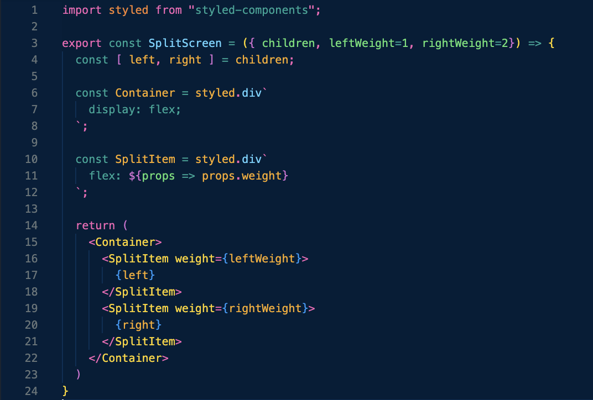

We defined the children components (`LeftSplitComponent` and `RightSplitComponent`) for `SplitScreen` in `App.js`. The weight prop within the `SplitItem` components are set to same values as the `leftWeight` and `rightWeight` props for `SplitScreen`. 

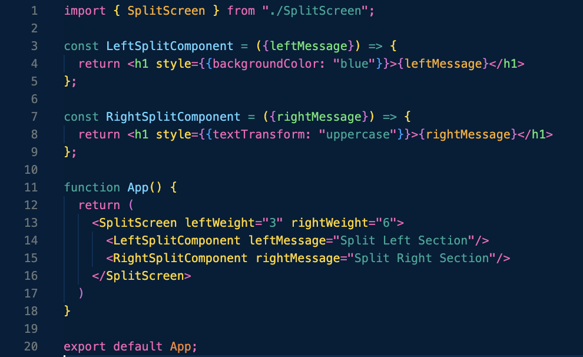

## List components
We're going to look at 2 different ways to create lists in React.

### Regular Lists
The `RegularList` component maps through all of the items passed to it, and creates `ItemComponent`s. The `ItemComponent` props should be real, live components that you built- in this case, we're going to pass `LongSupplyListItem` or `ShortSupplyListItem`. Both just return elements found in their arrays, in different layouts. After a bit of destructuring, you can see that `ShortSupplyListItem` returns the supply/utensil and its purpose, for every item passed to it, while `LongSupplyListItem` returns the supply/utensil, the purpose, the color and its ID.

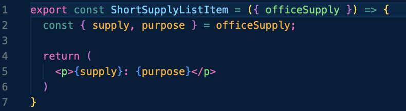

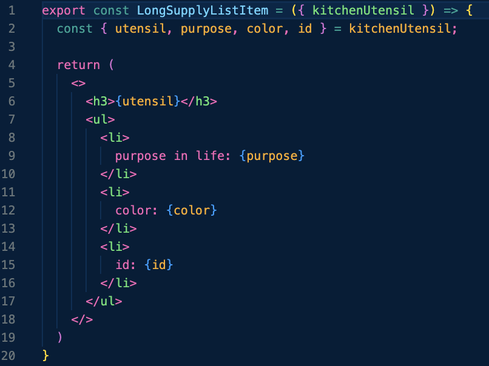

Back in `App.js`, we defined the `kitchenUtensils` array of objects to use with this list component.
 
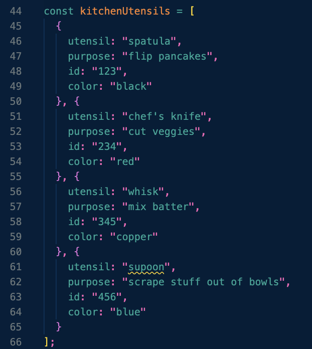

To get the lists to display properly, the `itemResourceName` prop value is the singular version of the `items` array you pass to `RegularList`. (i.e. officeSupplies => officeSupply). That `itemResourceName` then matches the prop that got passed to either `ShortSupplyListItem` or `LongSupplyListItem`. The value of `ItemComponent` is whatever type of list item component you want, either the short or long.

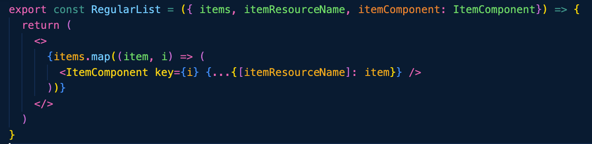

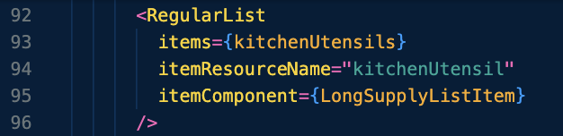
### Numbered Lists
This is very similar to the `RegularList` component, except that it uses the `index` of each item in the array. Those indices are also mapped through to create the returned numbers.

Here is another `officeSupplies` array we created in `App.js` that has a bunch of objects in it:

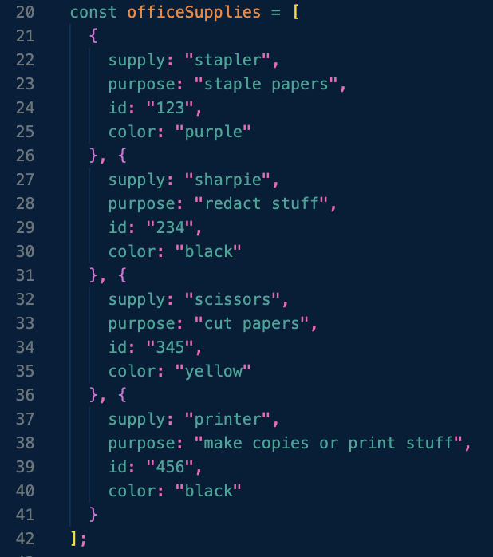

Each time we iterate over `officeSupplies`, `i` increases, and displays like a numbered list.

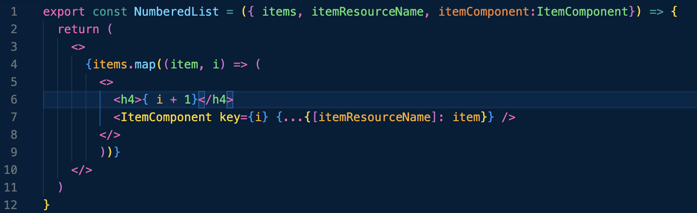

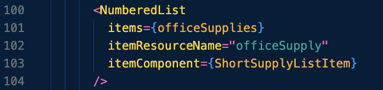

## Modals/Dialogs

Getting ahead a little, this is an example of an _uncontrolled_ modal or dialog. All state regarding showing or not showing the modal is taken care of by the `Modal` component itself. However, you'll see there are a few other components that make up `Modal`--`ModalBackdrop` (this is used to visually obscure the page while the modal window is shown) and `ModalBody` (which is what gets displayed and where any children and content will live). Anything that should be displayed within the modal window itself is passed to the `Modal` component as children within `App.js`.

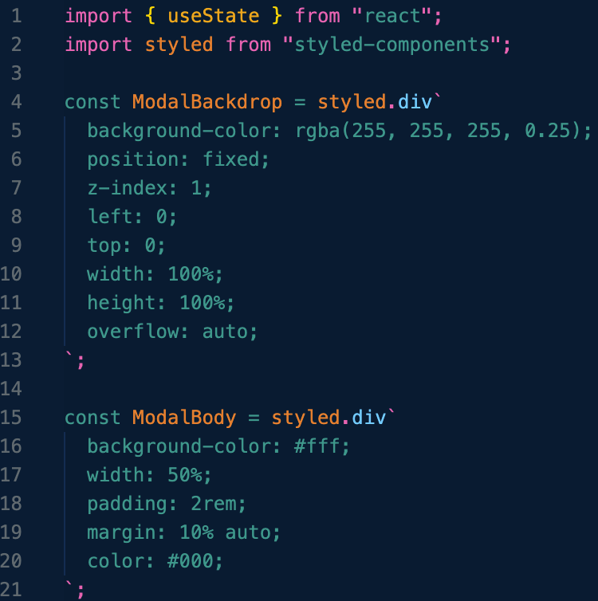

You can see that `Modal` is the component returning the `button` that triggers the new window. That `onClick` function just switches the state to `true`, and boom 💥- show a modal! Once the state of our modal window turns to `true`, the content we want to actually show appears. The `ModalBackdrop` click event sets the state back to `false` (which basically says if you click anywhere that's NOT the literal modal window, close the modal), but the `ModalBody` stops the click event from doing that (note the `e.stopPropagation()` functions). There is, however, a button in this `ModalBody` to reset our modal's state to `false` and close the modal.

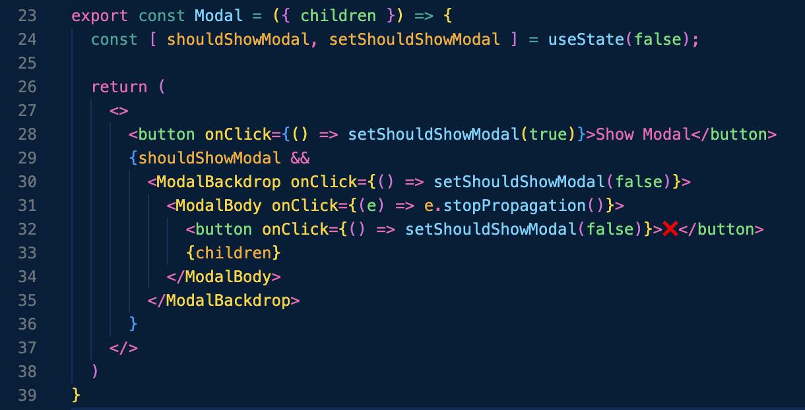

In `App.js`, anything that is a child of the `Modal` component, is the content you want displayed when the modal window is open. In this case, we used another `RegularList`, and put in a little heading. 

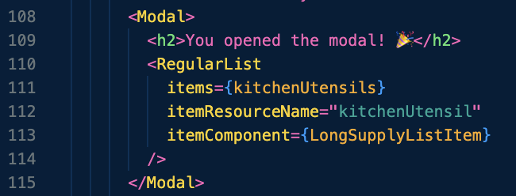

Hope you learned a lil' somethin' somethin'! I can see why layout components are such a big deal and used all over the place. 

### **Happy Coding! 🚀**

