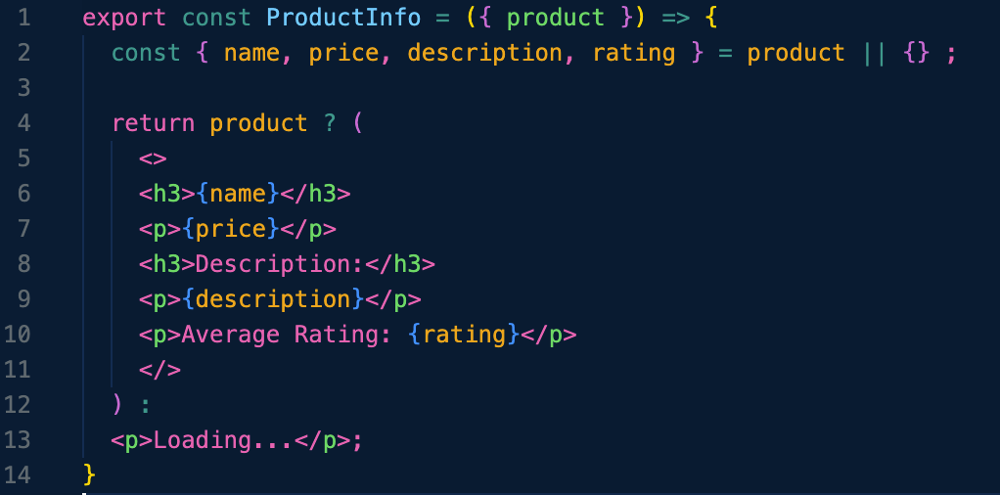
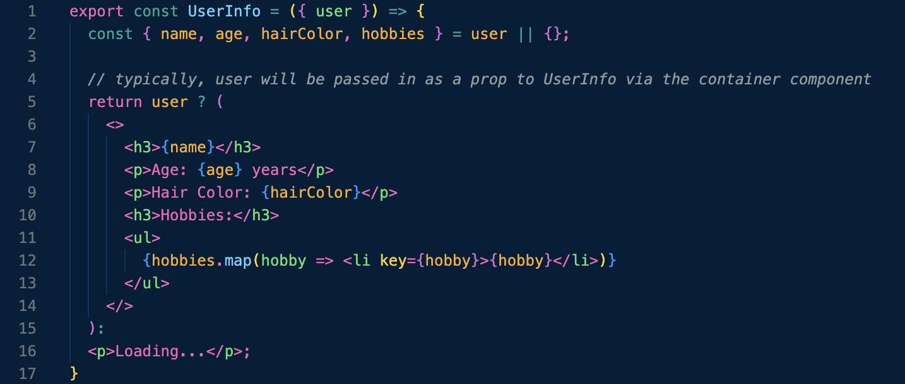
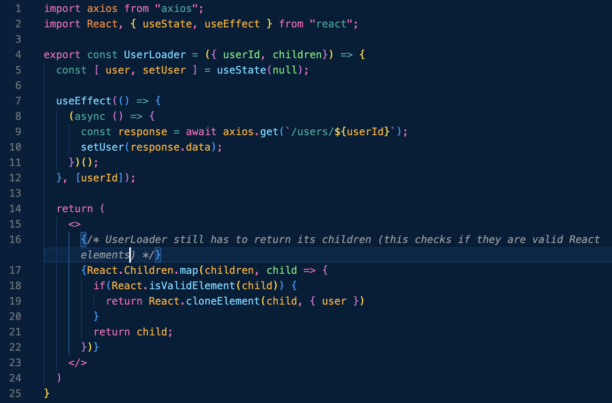
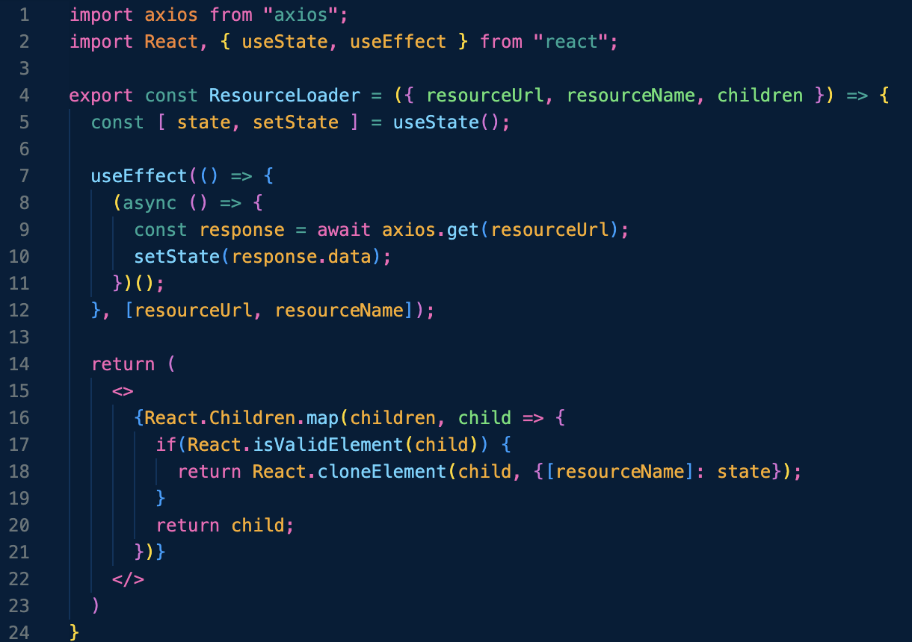
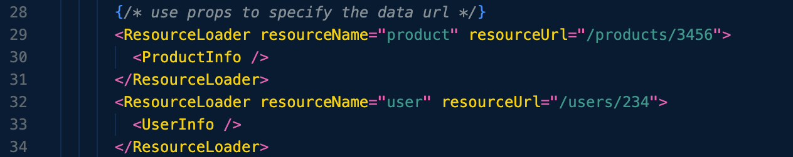
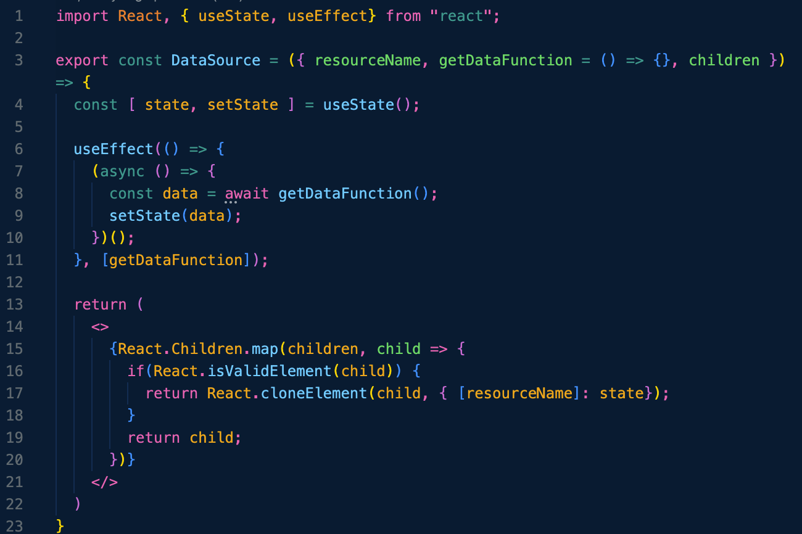
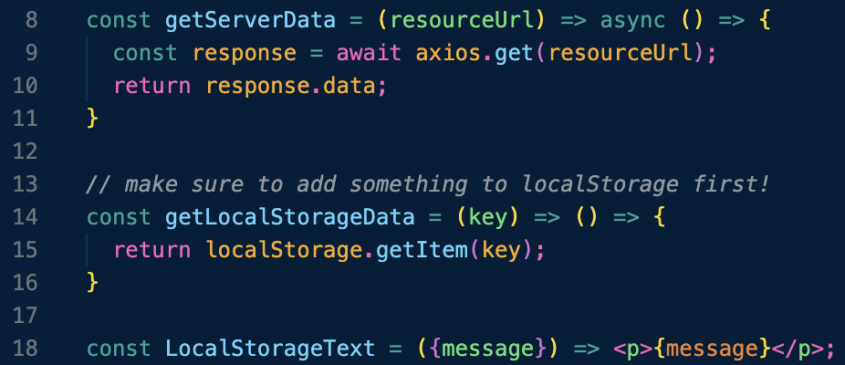
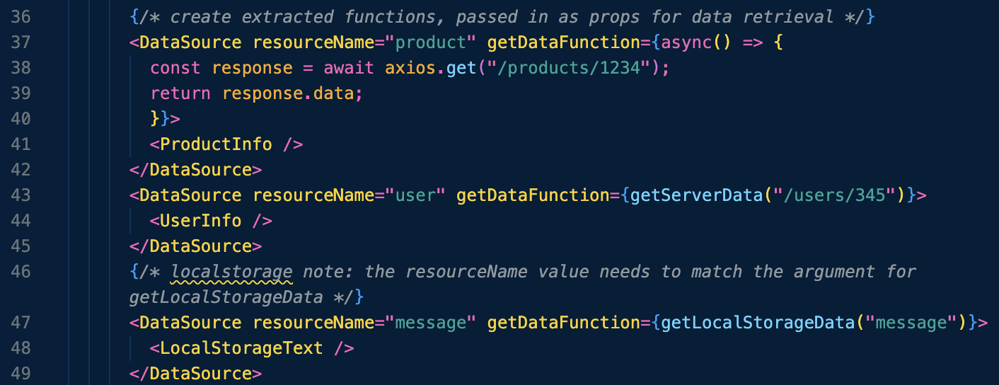

# Container Components in React

This branch is dedicated to practicing components that control the retrieval and flow of data to other components.

Container components will handle loading the data from a server, and pass the returned data to any child components. We want to split and separate that fetching logic into its own component. 

Since the container takes care of loading the data, it can then automatically pass that data to children components. Our children components shouldn’t need to know where their data is coming from. This offers more flexibility and the children are more easily tested.

**Make sure to run `node server.js` in this branch first, then run `npm run start`. You'll see a bunch of "proxy" errors in your terminal. Running `node server.js` command sets it up as a sort of database for this branch.**

## Extra Components We'll Be Using
Both of the components below are the children of our container components. These are the components that we want to pass information to, and the content we actually want to see. 

`ProductInfo` takes a product as an argument, destructures it, and as long as the product isn't null, it'll return the products name, its price, a description, and a rating. 

`UserInfo` is basically doing the same thing, but with users. You'll retrieve the name, age, hair color and some hobbies of each person.

As our container components load the data from `server.js`, you might see the "Loading..." paragraph element. You can see both the `users` object and the `products` object in `server.js`. 

## UserLoader

`UserLoader` is retrieving the user object first (from the `server.js` file). Those results will then get passed to the `UserInfo` component. UserLoader still has to accept children as well, since that where our information is visually displayed.

By giving `UserLoader` a `userId` value, the whole person object associated with that id gets funnelled into `UserInfo` (as the `user` prop seen above). Then `UserInfo` can destructure that object and display or do whatever it wants with the data.

## ResourceLoader

To make our container components more generic, `ResourceLoader` can take in any bit of data (in this case, either users or products), and returns what it finds in the server. To make it more flexible, however, `ResourceLoader` has more props, including `resourceUrl`, `resourceName`. It also has to accept children, in order to visually display any of the data it finds in `server.js`. 

This time within `App.js`, we specify the entire URL for the piece of data we want. Additionally, the `resourceName` matches one of our info components (either "user" or "product"). This `resourceName` ends up getting assigned to `ResourceLoader`'s state, and ultimately updated when the `axios.get` request occurs. Once the `resourceUrl` is passed, either of the components can take it from there. 

### _Shaun Wassel said in his course that this is probably sufficient for most projects, but continues to refine the container component with `DataSource` next._

## DataSource

To get **even more** generic, and therefore flexible and reusable, we can create a component that doesn't even care where its data is coming from. `DataSource` has a new prop called `getDataFunction`, which is where the fetch call is actually going to be declared. That function indicates where to grab that information instead. At this point, `DataSource` doesn't know where our `server.js` file is, or even if it has to `axios` to find some data. 

In `App.js`, a few more functions are declared. These are the functions that are going to get passed to `DataSource` when it's time to make some data requests.

* `getServerData` is basically just an extraction of the `useEffect` function found in `UserLoader` and `ResourceLoader`. 

* `getLocalStorageData` is an example of retrieving some information that might be in your browser's local storage (for this to work, you must add a key and a value within the "Application" tab of your browser).

* `LocalStoreText` is just a small component to display the message found from that `getLocalStorageData` call. 

In `App.js`, there are several ways to incorporate the `DataSource` component. You can declare the `getDataFunction` inline, or you can call back to a declared function somewhere else in the file. 

Hope you learned a lil' somethin' somethin'! Being able to separate the tricky data retrieval functionality from the components that actually display that data makes some pretty logical sense. It would also make testing the individual components easier to test (because you can just pass in values instead of waiting on data), although I don't have any example of that in this repo. 

### **Happy Coding! 🚀**
