# Controlled vs. Uncontrolled Components in React

This branch is dedicated to showcasing the differences between controlled and uncontrolled components. 

Most often, it is best practice to use a controlled component. A controlled component's parent is keeping track of things like state or data. That then gets passed down through props and callback functions. That's why it's called a _controlled_ component. It's almost like a controlled component is "dumb."

An uncontrolled component keeps track of things itself. To get any information out of an uncontrolled component, an event likely has to occur (like hitting the submit button for a form).

## Controlled vs. Uncontrolled Modals

These modal components have a lot of the same elements, and their overall goals are the exactly the same. They both rely on `useState` to determine if they should be showing or not (although the controlled modal window gets that state change through a prop instead). Both need to accept children as props, and those children are the actual content of the modal window itself. 

The controlled modal can’t do anything itself. The only way this component works is if the parent component is handling the modal’s state and passing those changes to it via props. It has to wait for `App.js` to say it's clear to display itself.

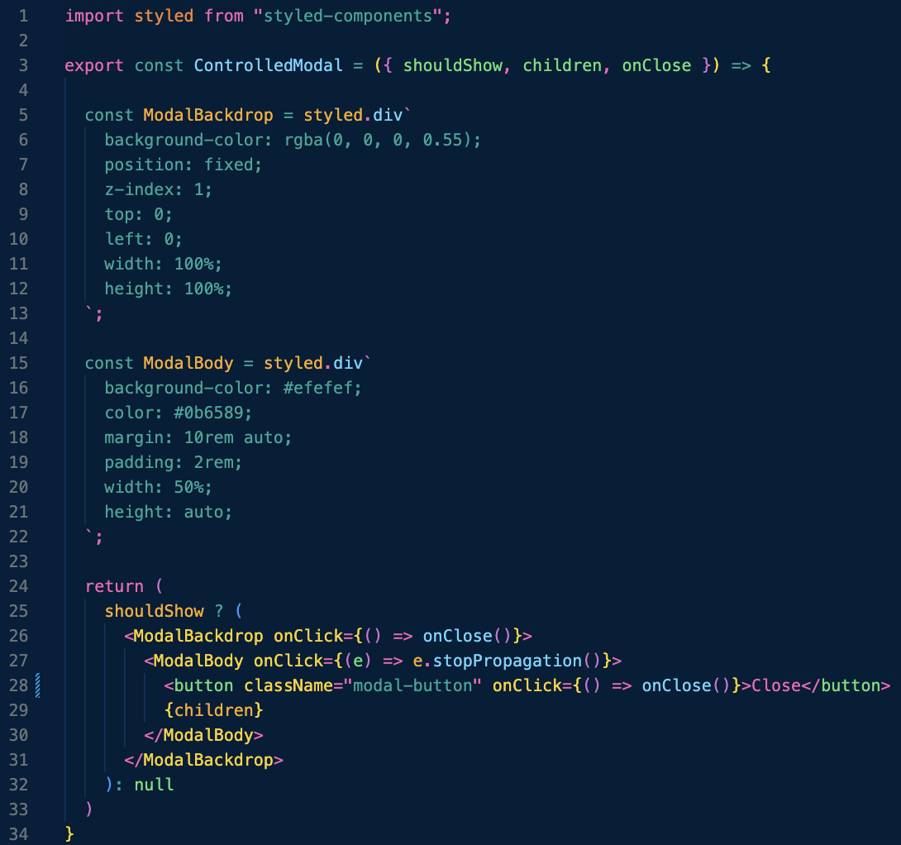

When the state changes in the parent, that trickles down to this modal, and that's how the parent then _controls_ when it shows the modal child.

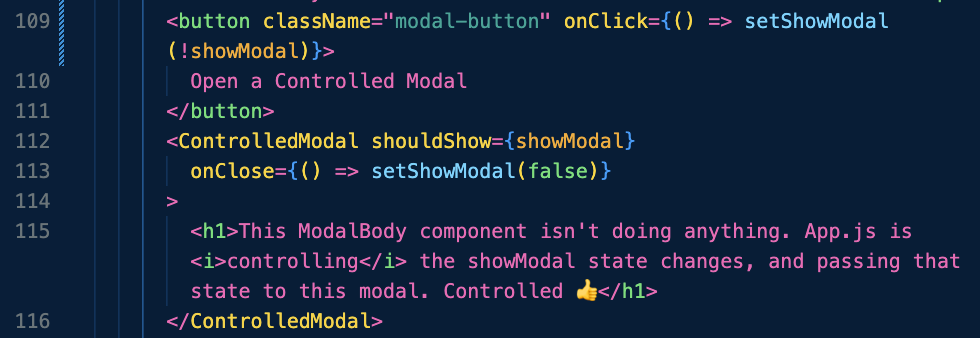

The uncontrolled modal is independent from its parent. It has its own button that toggles showing the modal or not. It has to have everything it needs to work within itself. 

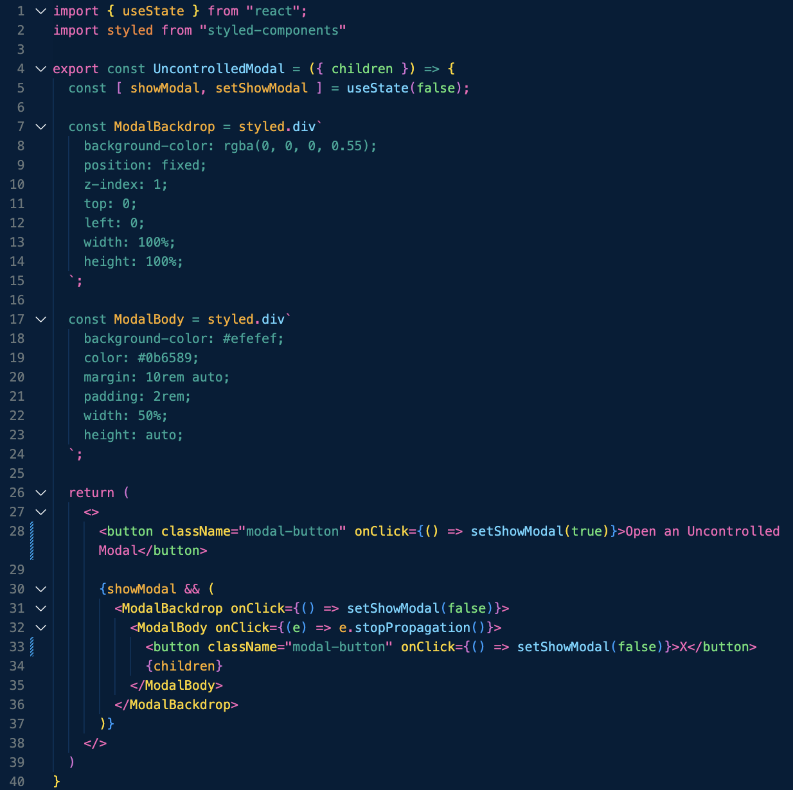

The uncontrolled modal takes care of changing its own state, which means the parent component can't really "do" anything if that modal shouldn't actually show. 

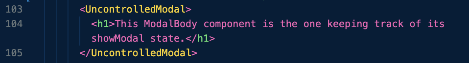

## Controlled vs. Uncontrolled Forms

Once again, both forms has lots in common: each gathers the same types of data, and each has a submit button to do something with that gathered data.

The controlled form however, is validating the data immediately. Typically, this leads to a better user experience since the user knows something isn't correct before they even try to submit their info. The `useEffect` hook is checking the state of the `firstName` variable, to ensure that its length is longer than two characters. If `firstName` isn't two characters or longer, a new `nameLengthError` message will appear in the UI to warn the user before submitting the form. As soon as `firstName` reaches the 2 character length, the message disappears and the user continues.

In this particular example, we have `state` for each input, however, we're only checking the `firstName` variable, just to show what's possible. 

The other big difference is that we can use the default submit functionality of an HTML `button`, instead of an `input` with a type of `submit`. There's no need to write a `handleSubmit` function in this component. 🥳

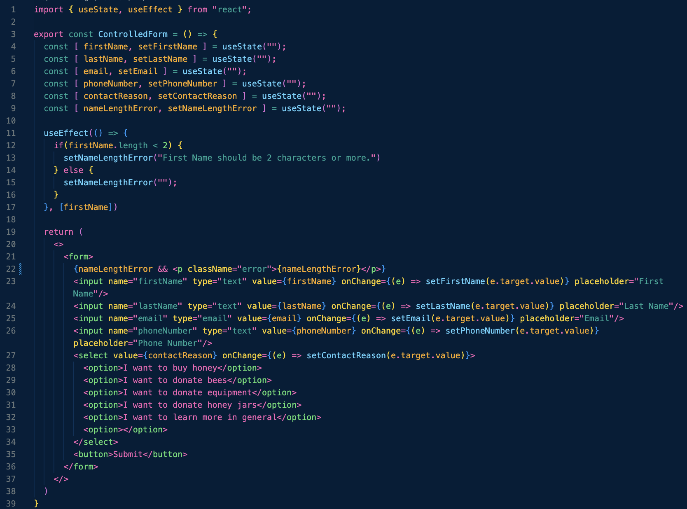

In the uncontrolled form, there's no form validation happening until after the submit button has been clicked and `handleSubmit` function has been triggered. The values of the inputs in this form are not being tracked until that moment. Once `handleSubmit` is called, it checks all the `ref`s of the inputs, and returns errors if needed. 

In this particular example, we're only checking the `firstNameRef` variable, just to show what's possible. 

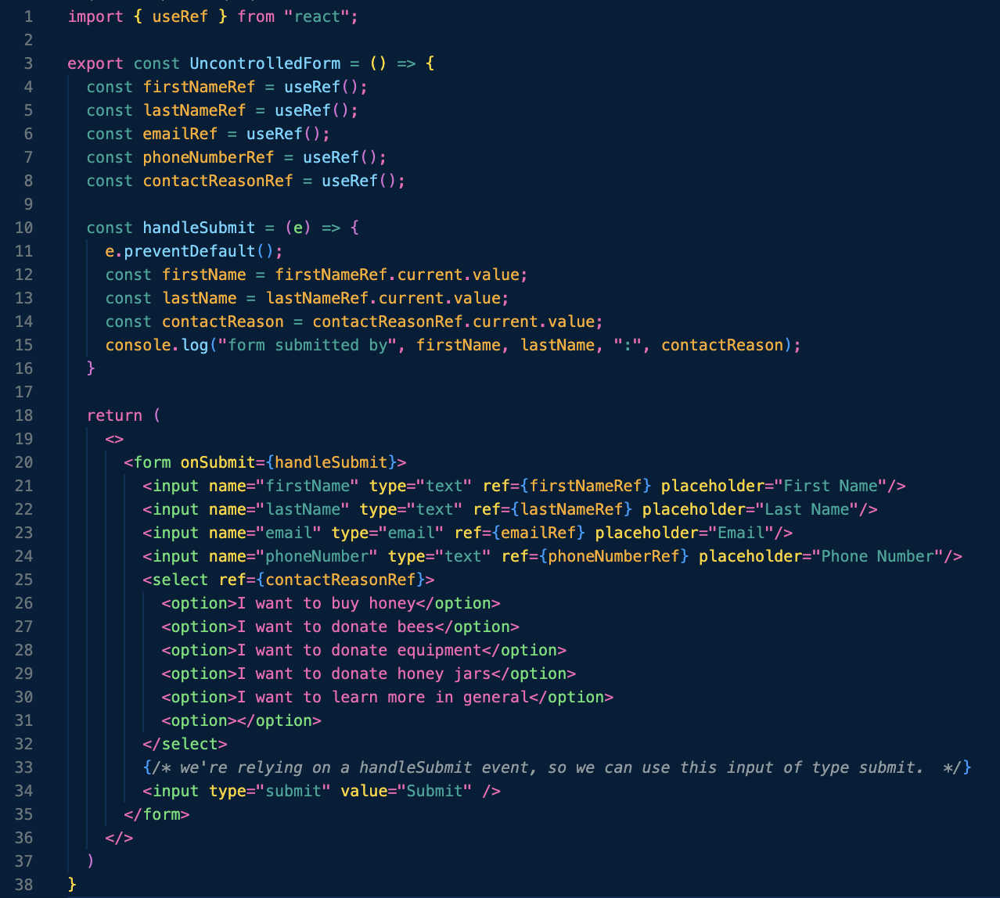

### **Bonus Article**

Want some really great examples of controlled and uncontrolled forms? [Altlogic: Difference Between Controlled and Uncontrolled Components](https://www.altogic.com/blog/difference-between-controlled-and-uncontrolled-component#:~:text=Controlled%20components%20in%20React%20allow,of%20state%20in%20larger%20projects.) In that article, they take it one step further, by extracting the state from the `input`s completely, and passing any `setState` updates to their controlled input through a prop (just like we did with the controlled modal). 

## Controlled vs. Uncontrolled Flows

Let's say you were creating a sign up form. You wanted to get their name, their age, determine if the signee is eligible could get a discount based on that age, and email. Both of the onboarding flow components in this branch are collecting most of that data, but one is doing itself, while the other has the parent component doing the heavy lifting. In our example, we have some conditional steps in an onboarding flow: a brief screen where the user will see that they will get a discount because they are of a certain age. 

A controlled onboarding flow extracts the state and any data away. With state and data being stored in `App.js` (the parent), we have much more control & flexibility over what we want to display to users. Instead of keeping track of the state of the onboarding data, what onboarding step its on, and which child to display, that all gets passed to `ControlledOnboardingFlow` as props. All `ControlledOnboardingFlow` has to do is create an array out of its children (seen on line 7), and update the `currentChild` with the new flow step (as seen on line 10- passing the `{goToNextStep}` object). The `goToNextStep` function is actually just using the function from the `onNext` prop.

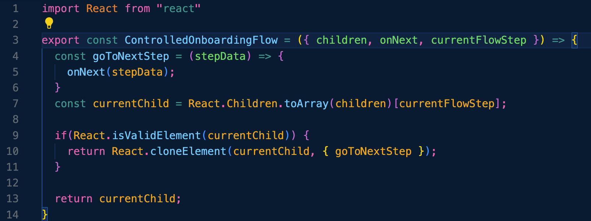

In `App.js`, we are controlling any data updates with `state`. We have new props to pass to `ControlledOnboardingFlow`, as well as the `onNext` function to tell `ControlledOnboardingFlow` which step to show next in the process.

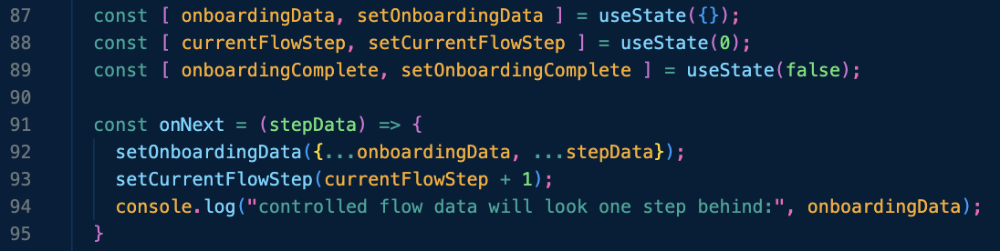

Also in `App.js`, there are several additional onboarding step components declared. Each of these components tracks the state of whatever variable its tracking for `ControlledOnboardingFlow`. Each time the step component's button is clicked, the `onboardingData` variable in `App.js` gets updated. _That_ updated data is what gets passed into `ControlledOnboardingFlow`.

`ControlledOnboardingStepFour` component is in control of when the flow is complete. Clicking that button will update the `onboardingComplete` state to `true` in `App.js`, and displays a span to the user that they are done. 

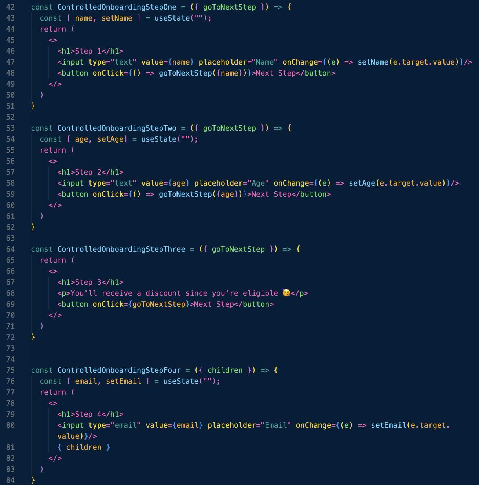

To implement the `ControlledOnboardingFlow`, those step components will be nested as children since `ControlledOnboardingFlow` can accept and return children. The additional props `ControlledOnboardingFlow` has, however, require the state variables that were declared in `App.js`. Because each separate onboarding step component is updating the `App.js` state, declaring the `currentFlowStep` prop as `{currentFlowStep}` will keep passing those changes to `ControlledOnboardingFlow`. We have an `onFinish` function that is declared inline to tell `ControlledOnboardingFlow` how to end the flow (it simply shows a quick alert to the user that they're done), and the `onNext` prop is passed the `{onNext}` function that is also declared in `App.js`. 

Now, because we're just working with JSX, we can use some conditional writing to display certain onboarding steps! On line 138, you can see that by analyzing the `onboardingData.age` object, if that age value is 59 or above, the user will see an extra screen! If the age gathered in less than 59, the user simply moves onto the final step. 🤯

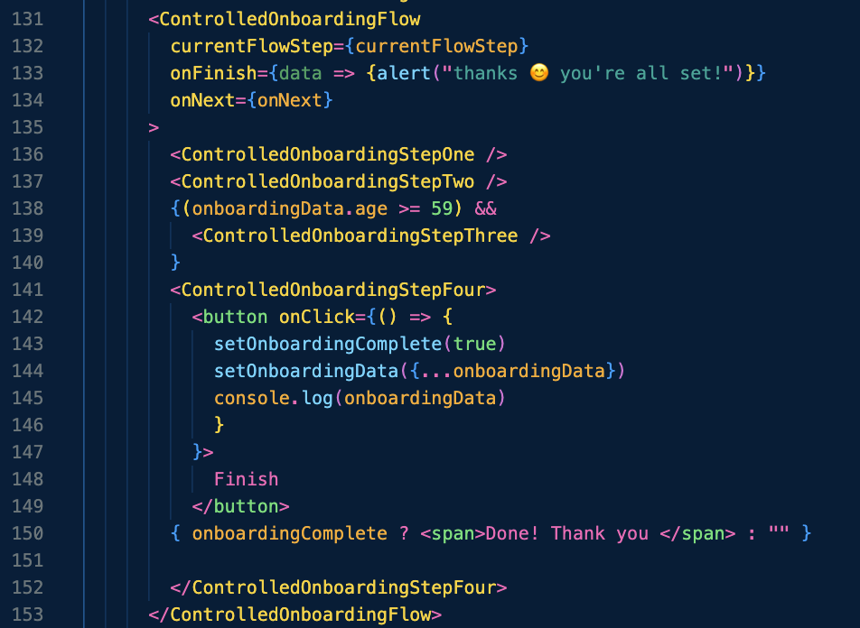

**Note: I don’t have the “Finish” functionality completely worked out for the controlled flow**

Uncontrolled flows are going to do what they do. `App.js` doesn’t have a say in what the flow is displaying, and therefore, getting any condtional onboarding steps implemented may be significantly trickier. Our `UncontrolledOnboardingFlow` will take in `children` as props, and will also need an `onFinish` function passed to it. This `onFinish` function will tell `UncontrolledOnboardingFlow` how to end the flow. 

Additionally, within the component itself, you should see a `goToNextStep` function. This function basically takes the data that each child will return, and stores all of that returned data in a state variable called `onboardingData`. This is also the function to display the child components. When React returns a cloned child, it passes the new `goToNextStep` flow step to the `currentChild` it's displaying (line 27 shows passing the new flow step to the `currentChild`), which corresponds to the index number of the array of children components we created (which was created on line 7).

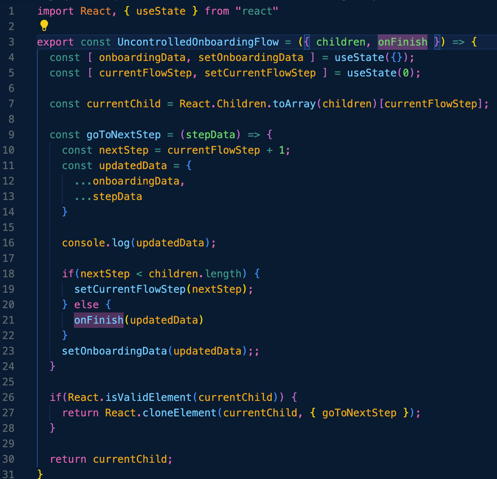

Within `App.js`, there are a few onboarding step components declared. These are the individual screens that a user should move through as they progress through the sign up flow. Each step has a new variable and state of that variable they are each in charge of. The `goToNextStep` prop in each step component gets connected to the `goToNextStep` function seen in `UncontrolledOnboardingFlow`, and then update's `onboardingData` with the new data as well. 

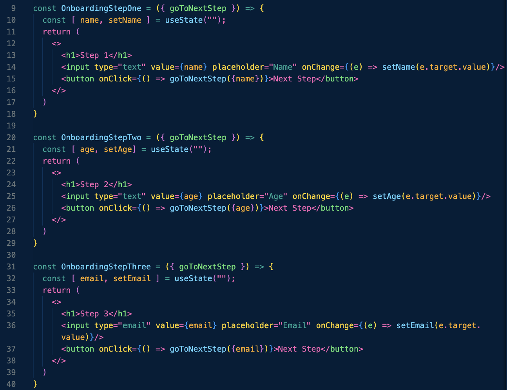

`UncontrolledOnboardingFlow` is fairly simple to call within the parent component. Each onboarding step component is nested with `UncontrolledOnboardingFlow`, and the `onFinish` function is declared inline to return a simple `alert` after the data has been collected.

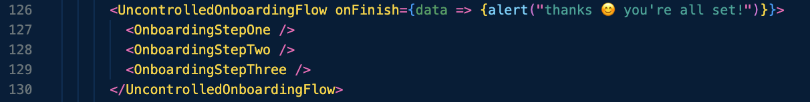

Hope you learned a lil' somethin' somethin'! The biggest thing I learned in this section of the course was that controlled components are easier to test and debug. This is because the state of the component is "exposed", since the state is actually being watched by the parent instead. Uncontrolled components can be a more little unpredictable, namely because their state isn't attached or connected to the parent state at all.

### **Happy Learning! 🚀**

